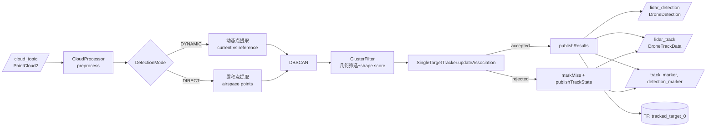
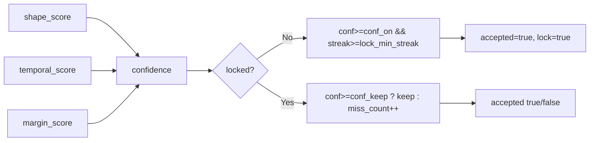
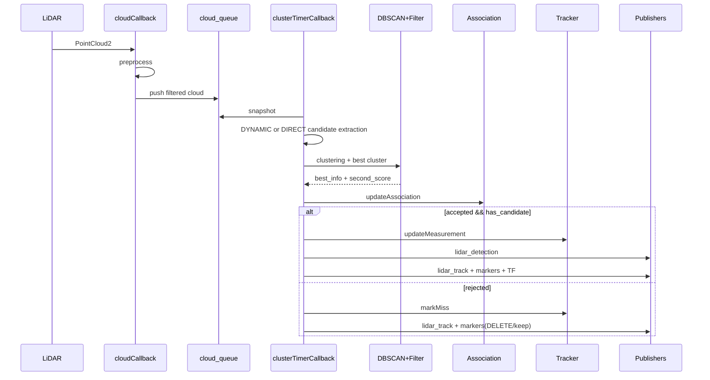
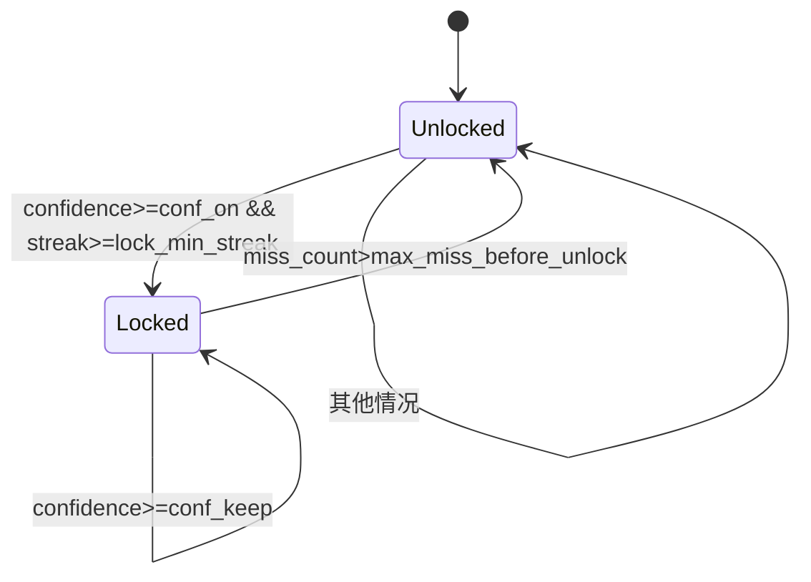
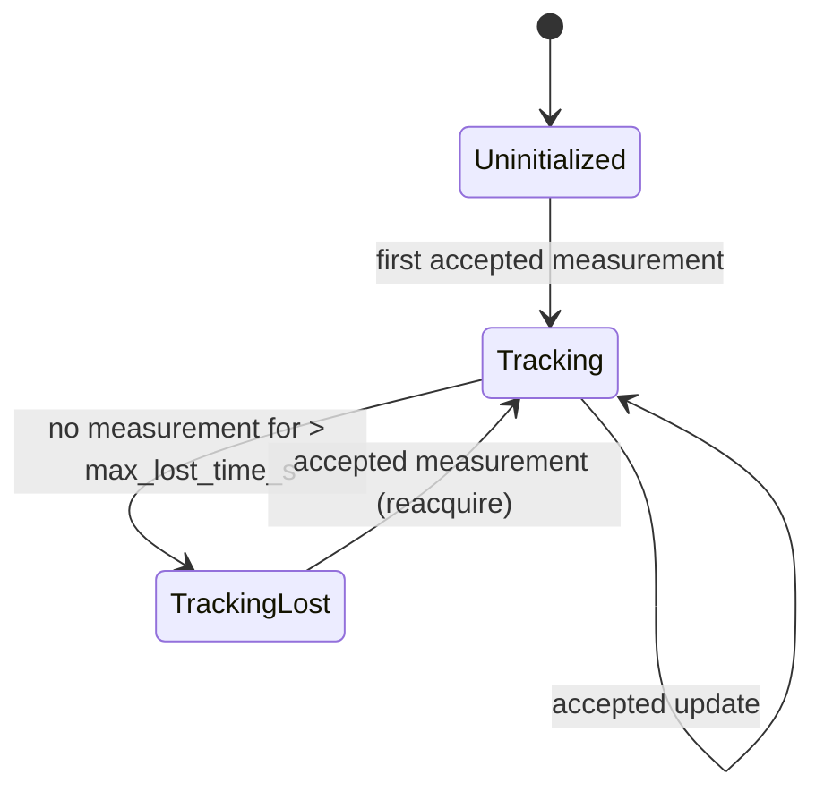
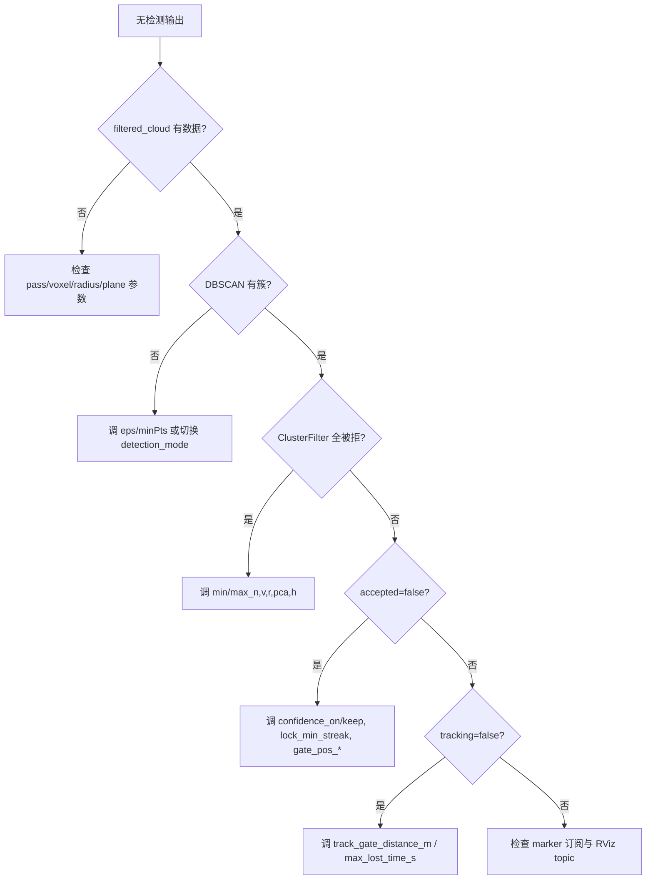

# rm_radar_lidar_detector 技术文档适用对象: 维护/二次开发该包的工程人员

> 文档目标: 从工程结构、运行链路、算法细节、参数体系、扩展点、故障排查六个层面完整覆盖该包

---

## 1. 包定位与职责

`rm_radar_lidar_detector` 是一个 **ROS1 Nodelet** 包，用于从 LiDAR 点云中提取空中目标候选，完成候选聚类、几何筛选、跨帧关联与单目标跟踪，并输出检测与跟踪结果。

核心职责:

- 点云预处理: 裁剪、降采样、去平面、离群点剔除
- 候选生成: 动态点模式 / 累积点模式
- 聚类: DBSCAN
- 候选打分与筛选: 点数、体积、形状比、PCA 比率、高度
- 跨帧数据关联: 置信度锁定、歧义抑制
- 单目标状态估计: 位置、速度、偏航、角速度、加速度
- 可视化与消息发布: `DroneDetection`、`DroneTrackData`、Marker、TF

---

## 2. 目录结构

```text
rm_radar_lidar_detector/
├── include/
│   ├── lidar_detector.h        # 主 nodelet 编排
│   ├── cloud_processor.h       # 预处理
│   ├── dynamic_detector.h      # 动态点提取接口
│   ├── dbscan.h                # DBSCAN 聚类
│   ├── cluster_filter.h        # 候选筛选与评分
│   ├── track.h                 # 关联+跟踪
│   ├── visualizer.h            # 可视化构建器
│   └── types.h                 # 公共数据结构
├── src/
│   ├── lidar_detector.cpp
│   ├── cloud_processor.cpp
│   ├── dynamic_detector.cpp
│   ├── dbscan.cpp
│   ├── cluster_filter.cpp
│   ├── track.cpp
│   └── visualizer.cpp
├── cfg/
│   ├── FilterParams.cfg        # dynamic_reconfigure 参数定义
│   ├── default_params.yaml     # 默认配置
│   ├── home_params.yaml        # 场地配置
│   └── lidar.rviz
├── launch/
│   └── lidar_detector.launch
├── scripts/
│   └── axis_visualizer.py      # 坐标轴可视化
└── nodelet_plugins.xml
```

---

## 3. 构建与加载

### 3.1 构建方式

- C++ 标准: `C++17`
- 目标产物: `librm_radar_lidar_detector`（Nodelet 动态库）
- 动态参数: `cfg/FilterParams.cfg` 生成 `FilterParamsConfig`

### 3.2 Nodelet 注册

`nodelet_plugins.xml` 注册类:

- `rm_radar_lidar_detector/LidarDetector`
- 实现类型: `rm_radar_lidar_detector::LidarDetector`

### 3.3 启动关系

`launch/lidar_detector.launch` 中:

- 启动 nodelet manager
- 加载 `LidarDetector` nodelet
- 加载参数文件到 `ns=lidar_detector`
- 启动 `axis_visualizer.py`
- 可选启动 RViz、rosbag 回放

---

## 4. 总体架构



---

## 5. 线程模型与调度

`LidarDetector` 在 `onInit()` 中将私有 `NodeHandle` 绑定到 `callback_queue_`，再启动单独线程用 `SingleThreadedSpinner` 处理回调。

```mermaid
flowchart TB
    subgraph MainThread
      A[onInit]
      B[setCallbackQueue]
      C[initialize]
      D[start worker_thread]
    end

    subgraph WorkerThread
      E[SingleThreadedSpinner.spin(callback_queue_)]
      F[cloudCallback]
      G[clusterTimerCallback @10Hz]
      H[dynamicReconfigureCallback]
    end

    A --> B --> C --> D --> E
    E --> F
    E --> G
    E --> H
```

说明:

- `cloudCallback` 负责采样与缓存
- `clusterTimerCallback` 固定周期消费缓存做检测
- 二者共享 `cloud_queue_`，通过 `cloud_mutex_` 保护

---

## 6. Topic / TF 接口

### 6.1 订阅

- `cloud_topic` (默认 `/livox/lidar`): `sensor_msgs/PointCloud2`

### 6.2 发布

- `filtered_cloud`: 预处理结果
- `removed_plane_cloud`: 被移除平面点
- `accumulated_cloud`: 累积点云
- `drone_cloud`: 当前检测目标簇点云
- `detection_marker`: AABB/centroid/track text
- `track_marker`: sphere/velocity arrow/trajectory
- `cluster_debug_markers`: 每簇调试信息
- `lidar_detection`: `rm_radar_msgs/DroneDetection`
- `lidar_track`: `rm_radar_msgs/DroneTrackData`

### 6.3 TF

- 发布: `target_frame -> tracked_target_0`
- 用途: 对外提供跟踪目标坐标系

### 6.4 坐标转换

`transform2Odom(frame_id, target_frame, point)`:

- 优先查 `now()` 时刻 TF
- 失败后回退到 `Time(0)` 最新 TF
- 双层失败时告警并丢弃该帧检测发布

---

## 7. 核心数据结构

### 7.1 `ClusterPoint`

- `x,y,z`
- `visited`
- `cluster_id`: `-1`噪声，`0`未分类，`>=1`簇ID

### 7.2 `BBox3D`

- `min_pt/max_pt/center/dimensions/orientation`
- `valid` 标记
- `volume()/ratio()` 辅助计算

### 7.3 `SingleTargetTracker::State`

- `initialized/tracking`
- `position/velocity/yaw/v_yaw/accel`
- `stamp/last_measurement_stamp`

### 7.4 `ClusterDebugInfo`

- 每簇的有效性、几何指标、评分、是否最优等
- 用于 debug marker 展示与 best/second-best 提取

---

## 8. 处理链路细化

### 8.1 预处理（`CloudProcessor`）

顺序:

1. PassThrough (x/y/z)
2. VoxelGrid 降采样
3. 平面移除（可关闭）
4. RadiusOutlierRemoval

平面移除机制:

- 可循环移除多个平面 (`plane_max_planes`)
- 每次平面需满足:
  - `inlier_count >= plane_min_points`
  - `inlier_ratio >= plane_min_inlier_ratio`
- 失败过多启用 cooldown，减少无效 RANSAC 开销

### 8.2 候选点生成模式

#### DYNAMIC 模式

- 取 `current_cloud` 与 `reference_cloud`（间隔 `frame_gap`）
- 对 `current` 每点执行半径搜索
- 若在参考帧半径 `distance_threshold` 内无邻居，则视为动态点

#### DIRECT 模式

- 对队列累积后的点云直接筛选 `z >= aircraft_min_z`
- 直接进入 DBSCAN

### 8.3 DBSCAN 聚类

- 空间索引: `OctreePointCloudSearch`
- `run()` 中将点标为噪声/簇
- 输出 `clusters_[cluster_id]`，`index 0` 空置

### 8.4 候选筛选与形状评分（`ClusterFilter`）

#### 硬门限

- `point_count`: `[min_n, max_n]`
- `volume`: `[min_v, max_v]`
- `ratio`: `[min_r, max_r]`
- `pca_ratio`: `[min_pca_r, max_pca_r]`
- 高度 `center_z`: `[min_h, max_h]`

#### 软评分

- `ratio_score`、`volume_score`、`pca_score`（log 空间中心化）
- 总分:
  - `0.45 * ratio + 0.35 * volume + 0.20 * pca`

### 8.5 跨帧关联（`updateAssociation`）

输入:

- 本帧 best 候选（及 second score）
- 上一帧关联状态

输出:

- `accepted`（是否允许进入跟踪更新）
- `locked`、`streak`
- `confidence`

关联置信度由三项构成:

- `shape_score`（当前几何）
- `temporal_score`（跨帧位置跳变+形态稳定+streak）
- `margin_score`（best 与 second 的分差）



### 8.6 单目标状态更新（`updateMeasurement`）

- 先 `predictTo(stamp)`
- 量测残差 `residual = z - predicted`
- 若 `|residual| > track_gate_distance_m`，拒绝更新
- 否则按 EMA 更新:
  - 位置: `pred + pos_alpha * residual`
  - 速度: `(1-vel_alpha)*v + vel_alpha*(residual/vel_dt)`
- 速度限幅 `track_max_speed_mps`
- 推导 `yaw/v_yaw/accel`

`publishResults()` 中包含重获取策略:

- 量测被门控拒绝后先 `markMiss`
- 若 `!hasTrack()` 则 `reset()` 后重试一次更新

---

## 9. 运行时时序（单周期）



---

## 10. 关联与跟踪状态机

### 10.1 关联锁状态（逻辑层）



### 10.2 跟踪状态（估计层）



> 说明: 代码中 `tracking` 是布尔状态，不是显式枚举状态机类，但行为等价如上。

---

## 11. 参数体系

### 11.1 层次来源

```mermaid
flowchart TB
    A[cfg/default_params.yaml or home_params.yaml] --> B[rosparam load -> /lidar_detector]
    B --> C[initParams() 初值]
    C --> D[dynamic_reconfigure 在线调整]
    D --> E[各模块 setParams]
```

### 11.2 关键参数分组

- 预处理
  - `pass_*`, `enable_voxel_downsample`, `voxel_leaf_size`, `radius_search`, `min_neighbors`
- 目标云
  - `/lidar_detector/target_cloud` reclusters `drone_cloud` and publishes the highest non-noise sub-cluster.
- 平面移除
  - `remove_planes`, `plane_*`
- 聚类
  - `eps`, `minPts`
- 候选几何门限
  - `min_n/max_n`, `min_v/max_v`, `min_r/max_r`, `min_pca_r/max_pca_r`, `min_h/max_h`
- 数据关联
  - `confidence_on`, `confidence_keep`, `lock_min_streak`, `gate_pos_base`, `gate_pos_range_k`
- 跟踪估计
  - `track_gate_distance_m`, `track_max_lost_time_s`, `track_pos_alpha`, `track_vel_alpha`, `track_max_speed_mps`, `track_velocity_min_dt_s`, `track_predict_max_dt_s`, `track_miss_velocity_decay`

### 11.3 `default_params` vs `home_params`

差异特征:

- `home_params`:
  - `remove_planes=false`
  - `minPts=100`, `min_n=60`, `max_n=3000`
  - 适配更大范围和更强点数约束
- `default_params`:
  - `remove_planes=true`
  - `minPts=5`, `min_n=30`, `max_n=300`
  - 更偏通用/小场景

---

## 12. 可视化系统

### 12.1 主可视化

- `detection_marker`:
  - 目标 AABB（红）
  - 质心（黄）
  - 跟踪文本
- `track_marker`:
  - 跟踪球（绿）
  - 速度箭头（黄）
  - 历史轨迹线（青）
- `cluster_debug_markers`:
  - 每簇 box + 文字
  - `[BEST]/[OK]/[REJ]` 直观标注

### 12.2 辅助脚本

`scripts/axis_visualizer.py`:

- 发布 `/axis_markers`
- 显示 XYZ 轴、刻度、滤波边界框
- 用于调参阶段空间认知

---

## 13. 已知工程行为与注意事项

- `cloud_queue_` 只存 **预处理后** 点云，后续检测都基于该缓存
- `clusterTimer` 固定 10Hz，检测频率与 LiDAR 原始帧率解耦
- `DIRECT` 模式会同时服务 `accumulated_cloud` 发布需求，减少重复累积
- `transform2Odom` 失败会跳过该帧检测发布，需重点检查 TF 连通
- 跟踪 marker 发布前检查 `getNumSubscribers()`，无订阅时不发 marker
- `track_msg.tracking` 条件为 `state.initialized && state.tracking`

---

## 14. 扩展点建议

- 多目标跟踪
  - 当前 `SingleTargetTracker` 仅单目标，可在 `updateAssociation` 后扩展多假设管理
- 关联特征增强
  - 增加强度、回波、速度先验等特征进入 `shape/temporal` 评分
- 模式自适应
  - 依据场景稀疏度动态切换 `DYNAMIC/DIRECT`
- 计算优化
  - 将动态点提取与 DBSCAN 并行化
  - 复用 KDTree/Octree 对象减少重复分配

---

## 15. 快速排障清单



---

## 16. 版本说明

本文档基于当前源码状态编写，已反映以下事实:

- `QualityMetrics` 相关实现已从该包移除
- 主流程日志为 `Q/lock/streak/accepted` 简化输出
